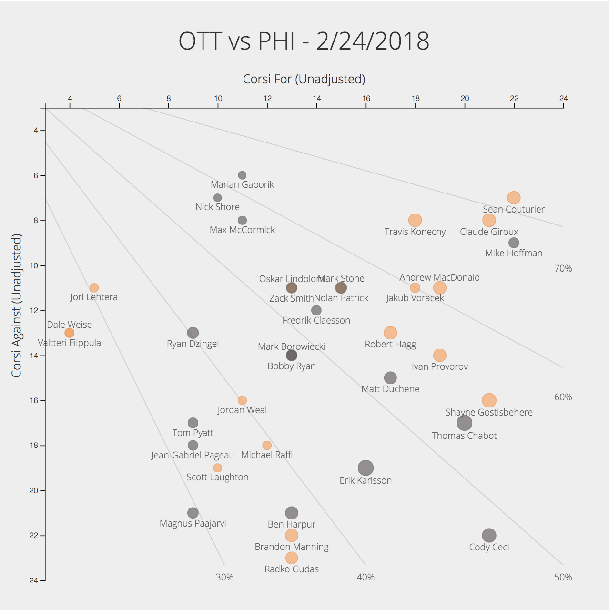

# Hockey Data Visualization with D3.js
#### Lesson 1/3
## Introduction
If you're the type of person who has wandered to a stranger's github page, it is likely you have occasionally stumbled upon beautiful data vizualizations all throughout the internet. It's possible you yourself have some experience making plots in R, Python, or Matlab. All of those languages have packages that make it extremely easy to visualize large amounts of data. These packages really are truly amazing, and often suffice for a _majority_ of projects. However, as you gained experience, perhaps you've realized how difficult it is to truly customize these visualizations. Perhaps you've even spent hours laboring to get integrate these plots with a website or app, only to settle for a low-quality screenshot of it. Maybe, in the back of your mind, you've wondered how the engineers at [The New York Times](https://www.nytimes.com/interactive/2017/12/21/us/2017-year-in-graphics.html) and [FiveThirtyEight](https://fivethirtyeight.com/features/the-ridiculousness-of-conference-tournament-locations-in-6-maps/) consistently make gorgeous visualizations that appear beyond the scope of ggplot or matplotlib. 

Far be it from me to come here and to tell you to divorce your dearest visualization library. I will tell that there exists another, however, that can satisfy your unquenched desires for beautiful, customized visualizations. Like a siren, one library has long been singing your name, waiting for you to turn towards its shores. Unlike the sirens, it will not lead you towards inevitable death, but expand your life into new horizons.

### Purpose
####Is D3.js right for me?
Now, it is important to not get ahead of ourselves. D3 is not for the faint of heart. If your project is primarily research-oriented, and you are simply using visualizations as a supplement (testing or the like), perhaps D3 is not best for that project. It comes with no built-in plots. You are far better off going to your room and crying whilst listening to Sufjan Stevens than trying to build a 3D scatter plotto analyze your spectral clustering algorithm with D3 .

However, if you want a single _robust_ framework that can be used to build completely customizable geographic visualizations, scatter plots, networks, etc... AND be easily integrated with any website or app, D3 may be the way to go.

D3 allows you to build a cohesive narrative through data visualization.

#### Is this Tutorial for me?
The following are recommended (but not required) to truly get the most from this tutorial:

- Some programming experience (Python, Java, JavaScript, or the like). Understanding variables, functions, and primitive types (including Arrays) is about what we're looking for.
- A *very baseline* understanding of HTML.
- Minimal understanding of hockey "advanced stats" terminology. For a great primer, see Charlie O'Connor's [article](https://t.co/nUgxqcrj9B) for *The Athletic*.

As I stated, all of the above are recommended but not required. I fully believe any keen hockey fan can make it through the tutorial. However, to gain an understanding of what's actually going on, all of the above are helpful! There are other projects out that will be more helpful for complete beginners.


## Getting Started
Let's start by cloning this github repository, which has the base HTML code, data, and directory structure already prepared.

To do this, first create a new folder for the project on your computer. 

#### Without Terminal
If you want to avoid using the command line, just press the green "Clone or Download" button at the top of this page, download the ZIP, and paste the repository into your new folder.
#### With Terminal
1. Open Terminal
2. Navigate into your new directory
3. Execute the following:

```terminal
$ git clone https://github.com/andrew-pete/Hockey-D3-Tutorial.git
```
Open up the project in your favorite text editor. Don't have one? Try [Atom](https://atom.io/)!

Notice the directory structure. The file that's rendered is `index.html`, which sits in the root directory. Also within our root directory there exists `data/` and `js/`. While one does not need to separate, it is a healthy practice to decouple JavaScript files, CSS, HTML, and your data. Notice that our game file `data/game.csv` is a comma-separated-values file. If you wish, open it up in Excel for a formatted view.

Finally, we need to deploy a local server. There are many ways to do this. This is necessary in order to load in external resources, like d3 and our data file. To do this, execute the following command:

```
$ python -m SimpleHttpServer 8000
```
In your web browser, navigate to the page [localhost:8000](http://localhost:8000).

##### Having trouble setting up your local server?
You likely don't have Python installed. Visit [this page](https://developer.mozilla.org/en-US/docs/Learn/Common_questions/set_up_a_local_testing_server) to troubleshoot.

### One last bit before we get started
Before moving on to coding, open the index.html file in your text editor. Notice how the file comes with several things already included. 

```html
<head>
	<link href="https://fonts.googleapis.com/css?family=Open+Sans:300,400,700" rel="stylesheet">
    <title>Hockey Viz with D3.js Tutorial - Part 1</title>
    <style media="screen">
      svg {
        font-family: 'Open Sans', sans-serif;
        background: #eee;
      }
      text {
        font-weight: 300;
        fill: #333;
      }
    </style>
</head>
```
In the header, there is a link to a google font (Open Sans), along with a little CSS for styling. The default font for HTML is Times New Roman. Please, I beg you, never use a serif font for visualizing data. Most serif fonts do not format numbers uniformly and are often eye sores in general. I've chosen Open Sans out of preference, but feel free to swap it out with [any other one](https://fonts.google.com) you choose.

Finally, at the bottom of the file, I've included the javascript file we will primarily be coding in along with the d3.js library.

```html
<script type="text/javascript" src="https://cdnjs.cloudflare.com/ajax/libs/d3/4.13.0/d3.min.js"></script>
<script type="text/javascript" src="./js/main.js"></script>
```

As I said previously, it is possible to include all of your JS code in the index.html file. However, it is generally good practice to separate the two.

## Wooh, let's code!
### Hold your horses! What's the end goal?
For this tutorial, we'll be making a scatter plot showing each player's Corsi-for and Corsi-against over the full game. Below are the variable mappings we want to utilize:

- Corsi For (X Axis)
- Corsi Against (Y Axis)
- Team (Bubble Color)
- Time on Ice (Bubble Size?)
- Player Name (As sort of text annotation)

As someone who has *definitely not done* this exact visualization before, this is a good idea of what our end result will be:



Keep these in mind as we begin to code.

**Okay, now we can seriously begin.**

### Pre-data Setup
Open up `js/main.js`. This is a completely empty file for now, but will soon include all of the logic needed to make a beautiful scatter plot.

First, let's defined some variables that we'll use universally. We don't want to have everything be global, so we will keep it limited.

```javascript
// GLOBAL VARIABLES
var width = 800;
var height = 800;
var padding = {
  top: 140,
  bottom: 40,
  left: 60,
  right: 60
};
```

These numbers aren't gospel, they are mostly set to allocate enough space for titles, axes, and whitespace. When selecting values, we realize we don't want the data to be over-concentrated. 

Later, we will add another variable to this section for team colors.

Next, we use d3 to create an svg element and append it to our `.container` div that already exists within index.html.

```javascript
// Create an svg element and add it to our container element
var svg = d3.select(".container").append("svg")
  .attr("width", width)
  .attr("height", height);
```

Notice that we are using the width and height variables we set above to set the svg's width and height attributes appropriately.

#### Scales - Part 1
A primary part of data visualization is scaling your data coordinates into screen coordinates. In mathematical terms, we need to create a mapping from our *data coordinate space* to the *screen space*. To set up scales in d3, we need to know the **range** (the interval of numbers to *map to*) and the **domain** (the interval of numbers to *map from*). The latter requires data, the former can be determined by the height, width, and padding variables we set earlier.

We initialize our scales as follows:

```javascript
var xScale = d3.scaleLinear().range([padding.left, width-padding.right]);

// In SVG coordinates (0,0) is the top left
var yScale = d3.scaleLinear().range([padding.top, height-padding.bottom]); 
```
`scaleLinear()` is a d3 function that initializes a linear scale. As stated above, we give it a range within our svg to map to. Since we want to have some space for axis labels on the left, and perhaps keys on the right, we set our xScale to be in the interval [\<left padding\>, \<svg width\> - \<right padding\>]. In our example, the range is [60, 740].

We also need a scale to determine the size of our bubbles. Now, contrary to Python, D3 uses a *radius* attribute for determining circle size. Recall from elementary math that Area is proportional to the radius squared. In other words, a two times increase in radius will result in a four-times increase in area. **This is crucial to understand**, since we do not want to over-exaggerate the importance of our radius variable. For us, this is time-on-ice. To account for this, we use a *square root* scale.

```javascript
// Area = PI*r^2
var rScale = d3.scaleSqrt().range([5, 10]);
```
For now, we set the radius interval to be between 5 and 10.

We will return to our scales later, once we load in the data to set their domains properly.

### Loading in the Data

D3 comes with it a number of functions that take in various data storage formats (CSV, TSV, JSON), and gives it to the user in an extremely usable data array.

It helps to understand how this API works, so we can understand what the heck we are doing. We diverge a bit from Python and R here into the land of functional programming.

```javascript
d3.csv(<file location>, <preprocess function>, <callback function>, ...)
```

`file location` will be a string that represents the location of the data file we are loading. This is either relative to the root folder or an absolute location. For us, the value will be `'./data/game.csv'`.

The second argument is a preprocessing function. Since our dataset is a CSV, all numbers will be loaded in as strings. In order to do any mathematical operations, we need to cast them to numbers. That's the purpose of this argument. This expects to receive a function that is then executed *line by line*. This is a bit tricky. Imagine that our CSV is really just a list of players, and each player has certain attributes like "Corsi For", "Time on Ice", etc... So we want our function to take in a *player object* with those qualities. Below is what we will use; it may take some time to conceptualize how it all works.

Define our preprocessing function (below our variables):

```javascript
function preProcess (player) {
  // We create an array of the attributes we want to cast to numbers
  // We loop through each attribute, casting the value to an int
  ["CF", "CA", "CF%", "CF%_Rel"].forEach(function(key) {
    player[key] = parseInt(player[key]);
  })
  return player;
}
```

Note: the `forEach` method is similar to python's `for element in arr:`. It's different in that it takes in a function to perform on each element. Javascript allows us to pass in *anonymous functions* (a function that has no name). If that makes no sense to you, fret not. You'll get used to it. Carry on.

Now, let's actually call this d3.csv method. For future reference, most of our logic will be placed in here. However, we will often define helper functions outside of the inner scope. Below will show the bounds of the call, but expect to place logic within the brackets unless told otherwise.

```javascript
d3.csv("./data/data.csv", preProcess, function (data) {
	// OUR LOGIC WILL GO IN HERE UNLESS STATED OTHERWISE
});
```

In the end, our function will call the third function with all of the preprocessed data bundled into an array.

Now that we have our data loaded in, let's finish off initializing our scales with appropriate domains.

**An Aside:** If, at any point, you want to see the state of a variable, simple add `console.log(<variable>);` to your code, refresh the page, and open the developer console (command + shift + i for mac).

#### Scales - Part 2
Okay, we now have everything we need to finish off those pesky scales. To do this, we will use a couple built-in d3 methods: `d3.max`, `d3.min`, and `d3.extent`.

Each of these has the same basic format, so we'll dive into an example with `d3.max`, knowing that it'll be identical for the others.

The API for `d3.max` is as follows:
```
var maxValue = d3.max(<data>, <func>)
```
Where `<func>` is a function that will determine what exactly we want to find the max of. In other words, this function will be executed for on element in the array, and whatever is returned by the function is what it will find the max of. 

Let's start with finding the min and max corsi-for values. In that case, we would find them like this:

```javascript
	// we want the maximum value of the corsi-for attribute
	var maxCF = d3.max(data, function (player) {
   		return player["CF"];
  	});
	// We do the same with our min, except calling with d3.min(...)
	var minCF = d3.min(data, function (player) {
		return player["CF"];
	});
```

We assign similar variables for our max and min corsi-against.

```javascript
	var minCA = d3.min(data, function (player) {
  		return player["CA"];
  	});
  
  	var maxCA = d3.max(data, function (player) {
    	return player["CA"];
  	});
```

Now, let's take a step back and think about our (future) scatter plot. Even though the max  values for our CF and CA are not always equal, we would like our graph to be symmetric. In other words, our x and y axes should start and end at the same value. For this reason, we want both of our x and y scales to be mapped to the same domain.

The minimum value of the interval should be `min(minCF, minCA)` and the max value should be `max(maxCF, maxCA)`. In JavaScript, we put:

```javascript
// Since we want graph to be symmetric
var minVal = Math.min(minCF, minCA);
var maxVal = Math.max(maxCF, maxCA);
```

However, maybe we don't want our axes to just go up to the max and min values. Let's add a bit of artificial "padding" to the scales above.

```javascript
// Since we want graph to be symmetric
var minVal = Math.min(minCF, minCA) - 1;
var maxVal = Math.max(maxCF, maxCA) + 1;
```

Now, our rScale is a bit more tricky. Looking at our data, we see that the times are given in the string form *mm:ss* (e.g. `'14:34'`). Unluckily for us, JavaScript cannot magically parse this and understand it as "14 minutes, 34 seconds". It also doesn't know how to compare to time strings like that. What it *does know* is how to compare two numbers (as we utilized earlier). We need to create a function to convert a TOI string to some number, either minutes or seconds. 

Let's define a function *outside of* our `d3.csv` scope (i.e. brackets):

```javascript
// toi in form <string> mm:ss
function timeInSeconds(toi) {
	// we utilize built-in javascript string methods to parse.
	var parsed = toi.split(":");
	// parsed is an array of strings with elements [minutes, seconds]
	var minutesInt = parseInt(parsed[0]);
	var secondsInt = parseInt(parsed[1]);
	return minutesInt*60 + secondsInt;
}
```
We utilize some JS-magic here to accomplish our task. First, we split our string into segments separated by a colon. For example, `"12:34".split(":")` returns `["12", "34"]`. We then cast each to a number and do some simple arithmetic to return the equivalent number of seconds.

Now we can finish off our `rScale`. Recall that third function I mentioned earlier? Don't scroll up, I'll remind you. It's `d3.extent`. This method is great, because it returns the min and max in one swoop. In a simple example `d3.extent([2,1,3])` will return `[1,3]`. Again, recall that d3 doesn't automatically know what we want to find the max and min of, so we tell it by passing in a function. We are now back into the scope of our d3.csv callback function.

```javascript
var minMaxRadius = d3.extent(data, function (player) {
	// want to find the min and max of this number value
	return timeInSeconds(player["TOI"]);
});
```
Easy! Let's toss those numbers into our scales and move on. 

```javascript 
xScale.domain([minVal, maxVal]);
yScale.domain([minVal, maxVal]);
// remember, minMaxRadius is already in form [min, max]
rScale.domain(minMaxRadius);
```

Sweet! Finished initializing the scales. While nothing is physically on the page yet, we are more than halfway there.

